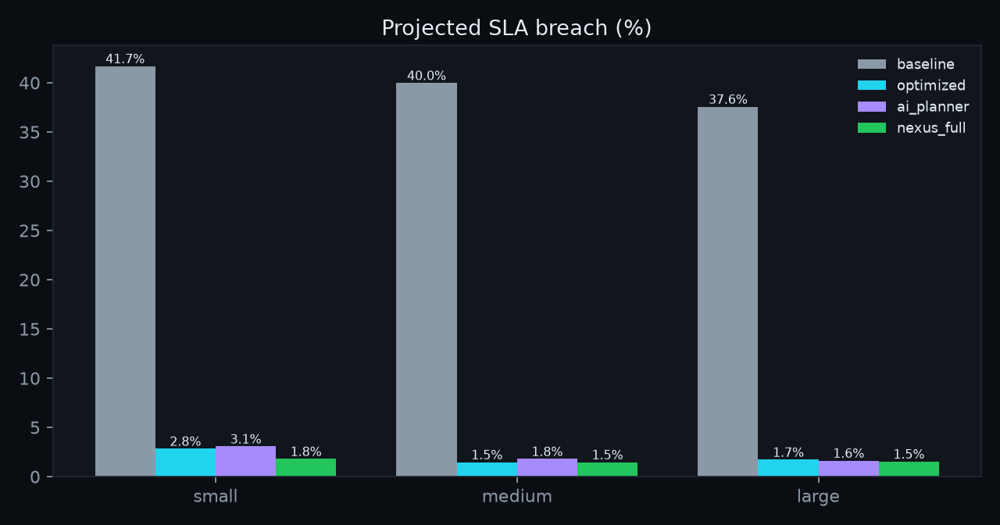
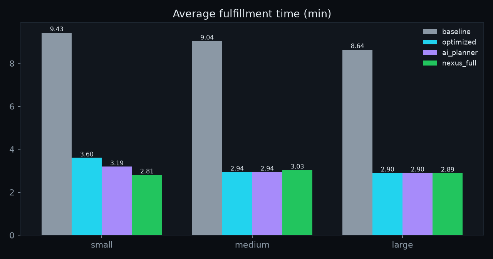

# NEXUS

> **Live demo:** [control room](https://nexus-twin-psi.vercel.app) · [API + OpenAPI docs](https://nexus-api-3nnv.onrender.com/docs)
> Free-tier hosting (Render + Vercel): the twin runs 24/7 via a keep-alive pinger; the cloud LLM is off by design — every plan is still validated, optimized, simulated and risk-checked deterministically.

**AI-native Digital Twin & Autonomous Operations Platform** — a virtual world that mirrors a physical operation, plus AI
agents that understand, predict, simulate and optimize what happens inside it.

[](https://github.com/raunitgrey7/nexus/actions/workflows/ci.yml)


%20%C2%B7%20zero%20API%20keys-22c55e)
[](LICENSE)

> Digital Twin + Physical AI + Multi-Agent AI + Simulation + Operations Research — without buying a robot.
> The first domain is a warehouse (robots, workers, inventory, orders, shelves, docks, chargers); the engine is
> domain-agnostic.

---

## The 60-second pitch

A warehouse: 12 robots, 12 storage zones, 4 loading docks, 18,000 inventory units, ≈ 4,000 orders a day, 7 workers.
Suddenly **robot R07 fails**.

A normal system says: `Robot R07 offline.`

NEXUS says:

> **R07 failure (motor fault) will increase average order fulfillment time from 2.1 to 9.2 min (+332%) over the next 60 minutes**
> (projected SLA breach 39.4% without intervention). I evaluated **9 candidate plans and 21 task allocations** in 18.8 s.
> **Recommended plan #1 — Add 2 robots + batching:** add 2 robots and batch 3 orders per trip
> (plan #2, *Reassign to R03 & R11, prioritise HIGH, route via C2*, scored 36.3%; plan #3, *batching 4/trip + deadline sequencing*, 36.8%).
> **Estimated impact: SLA breach 39.4% → 3.1%**, average fulfillment 9.2 → 4.5 min, throughput 438 → 546 orders/h.
> Risk LOW (transient peak zone load 2.0×; stable across 3 seeds, σ = 0.2%); auto-approved — projected SLA breach improves by 36.3% (≥ 2%).

That sentence is not written by a language model — it is rendered from a decision record (`nexus/agents/explain.py`) in
which every number comes from **simulating each candidate plan in a forked copy of the twin**, scoring it with a
multi-objective cost, and risk-checking it (deadlocks, safety, battery, regressions, stability across seeds). The LLM
only *proposes* candidates; mathematics disposes. The illustrative numbers above are the demo storyline — real,
reproducible numbers for the four strategies live in [`docs/BENCHMARKS.md`](docs/BENCHMARKS.md) and in every decision
record the platform produces.

And crucially: **before executing an action, NEXUS simulates it.** Only after simulation and safety validation is a plan
eligible for execution — automatically when risk is LOW and the gain is material, otherwise with a human in the loop.

---

## Architecture

```
                          ┌─────────────────────┐
                          │      NEXUS UI       │  Next.js 15 · Three.js · live 3D twin,
                          │  3D / 2D Twin View  │  decisions, what-if lab, forecast, console
                          └──────────┬──────────┘
                                     │ REST + WebSocket
                          ┌──────────▼──────────┐
                          │      API Layer      │  FastAPI · pydantic contract · /metrics
                          └──────────┬──────────┘
              ┌──────────────────────┼──────────────────────┐
              ▼                      ▼                      ▼
        Twin Engine            Agent Runtime          Event Engine
        WorldState          ┌──────────────┐          append-only store
        GridMap             │ Ops Manager  │          pure reducer
        SpatialGraph        │ Forecaster   │          bus · replay
              │             │ Planner      │                │
              │             │ Optimizer    │                │
              │             │ Simulator    │                │
              │             │ Risk         │                │
              │             │ Executor     │                │
              │             └──────┬───────┘                │
              └──────────────┬─────┘─────────────────────────┘
                             ▼
                      Simulation Engine      deterministic ticks · forks · process pool
                             │
                             ▼
                      Optimization Engine    CP-SAT · Hungarian · GA · batching · EDF · routing
                             │
                             ▼
                        World State
```

The agent pipeline — production-grade agentic architecture, not "LLM → move robot":

```
Goal → LLM planner + playbooks → structured plan → constraint validator → optimization engine
     → simulation in forked worlds → safety / risk validation → human / policy approval → execution
```

Details: [`docs/ARCHITECTURE.md`](docs/ARCHITECTURE.md) · [`docs/AGENTS.md`](docs/AGENTS.md) · [`docs/SAFETY.md`](docs/SAFETY.md).

---

## Feature tour

### Digital twin
Every entity has state — zones, shelves with inventory, robots (position, battery, status, task, path), workers,
orders with lines and deadlines, tasks, docks, chargers. `WorldState` is the single source of truth; it forks in
milliseconds, snapshots to bytes, and hashes to a deterministic digest. A **semantic spatial graph** (`R07 is_inside C`,
`C adjacent_to C4`, `ORD-8821 requires C-41`) gives agents and the console spatial *reasoning*, not just coordinates.
→ [`docs/DIGITAL_TWIN.md`](docs/DIGITAL_TWIN.md)

### Event-sourced world
Everything happens as typed events (`ORDER_CREATED`, `ROBOT_FAILURE`, `AISLE_BLOCKED`, `PLAN_EXECUTED`, …) applied by a
pure reducer. Append-only store, idempotency keys for external commands, bounded ring buffer for the live feed,
snapshots every 10 simulated minutes, and **replay**: snapshot + external events reproduces the exact world digest.
→ [`docs/SIMULATION.md`](docs/SIMULATION.md)

### Deterministic simulation
Discrete-time engine (1 tick = 1 s) with kinematics, cell capacities and congestion slow-downs, battery drain/charging,
picking and unloading with workers, A* pathfinding with congestion costs, Poisson order arrivals over a daily demand
profile with Zipf SKU popularity, replenishment, and fault injection. Same seed ⇒ bit-identical run.
Speed (baseline scheduler): **≈ 6k ticks/s small · 1.5k medium · 0.5k large**; with the optimizer ≈ 2k / 0.6k / 0.2k.

### Optimization (operations research)
One multi-objective cost — lateness, delivery time, tail, congestion, distance, energy, backlog — scores every plan,
what-if and benchmark. Robot↔batch assignment is a **CP-SAT** model (OR-Tools) with Hungarian and greedy fallbacks and a
memetic **genetic allocator**; order **batching**, priority-weighted **EDF** sequencing, and **routing policies**
(avoid zone X for 30 min, prefer corridor C4, congestion-aware costs). → [`docs/OPTIMIZATION.md`](docs/OPTIMIZATION.md)

### Forecasting
Holt-Winters demand forecast blended with the twin's demand-profile prior (prediction bands, capacity, projected
utilization), per-robot battery exhaustion and charger ETA, peak zone congestion, and ranked bottlenecks with concrete
recommendations — ≈ 3.5 ms per forecast. → [`docs/FORECASTING.md`](docs/FORECASTING.md)

### Multi-agent runtime
Operations Manager, Forecaster, Planner (local LLM + deterministic playbooks + SOP retrieval), Constraint Validator,
Optimizer, Simulator (process-parallel forked worlds), Risk Agent (with stability re-runs), Approval Policy, Executor,
Explanation. Every decision is a durable record with timings. Autopilot reacts to incidents with a cooldown.
→ [`docs/AGENTS.md`](docs/AGENTS.md)

### What-If engine
"What if demand rises 40%?", "What if we remove two robots?", "What if Zone B is inaccessible?" — a scenario DSL
(13 mutation types, 12 presets), evaluated under several strategies in parallel against a reference run, compared on
the shared KPIs and score, narrated. → [`docs/WHAT_IF.md`](docs/WHAT_IF.md)

### Natural-language console
Deterministic intent routing, parameter extraction into scenarios, transparent **delay attribution** ("Zone C
congestion accounts for ~61% of predicted delay"), grounded answers the LLM may only rewrite without changing a number.
→ [`docs/NLQ.md`](docs/NLQ.md)

### Visualization
A dark control-room UI: **Live Twin** (3D warehouse with zones tinted by congestion, robots by status, paths, KPI bar,
event feed, fault injection, "Decide now"), **Decisions** (candidates table, risk report, approve/execute, baseline vs
plan timelines), **What-If lab**, **Forecast**, **Console**, **Timeline** (KPI history + snapshot playback),
**Benchmarks**. Mock mode renders every page offline (`NEXT_PUBLIC_MOCK=1`).

### Safety
Closed action vocabulary, validation rules (never close the last storage zone, never remove more than a third of the
fleet, never send more than a quarter to charge, …), simulate-before-execute, risk findings with thresholds, stability
seeds, approval policy, attributable and idempotent events. → [`docs/SAFETY.md`](docs/SAFETY.md)

### Observability & persistence
Prometheus metrics (`nexus_sla_breach_projected`, `nexus_planning_latency_seconds`, `nexus_events_total`, …), a
provisioned Grafana dashboard, optional OpenTelemetry tracing, structured logs; PostgreSQL (or SQLite) persistence of
events, snapshots, decisions and what-if results; Redis fan-out of the live stream. All optional — the twin runs fully
in memory.

---

## Quickstart

### A. Docker Compose (everything)

```bash
git clone https://github.com/raunitgrey7/nexus.git && cd nexus
docker compose up --build
```

| Service | URL |
|---|---|
| Twin UI | http://localhost:3000 |
| API + OpenAPI | http://localhost:8000/docs |
| Grafana (admin / nexus) | http://localhost:3001 |
| Prometheus | http://localhost:9090 |

### B. Local development

```bash
make setup          # uv sync (backend) + npm install (frontend)
make api            # FastAPI + live twin on :8000
make ui             # Next.js on :3000 (second terminal)
make test           # backend test-suite
```

Requirements: Python 3.12+ with [uv](https://docs.astral.sh/uv/), Node 24+, (optional) Docker.

### C. Local LLM (optional)

```bash
ollama pull qwen2.5:7b     # NEXUS_LLM_MODEL; NEXUS_OLLAMA_URL defaults to http://localhost:11434
```

Everything works without it: the planner uses deterministic playbooks, explanations and console answers come from
templates with the same numbers, and every run stays reproducible. No API keys, anywhere.

---

## Demo script

```bash
cd backend
uv run nexus demo                                   # twin → R07 fails → candidates simulated → best plan executed
uv run nexus decide --scale small --warmup-min 60 --horizon-min 90 --candidates 8
uv run nexus whatif --preset demand-plus-40
uv run nexus run --scale small --minutes 120 --strategy optimized --fail-robot R07
```

In the UI: speed the twin up to ~10:30 simulated time → **Fail R07** → **Decide now** → inspect the candidates, risk
report and timelines → **Approve** → **Execute** → ask the console "Why are orders slowing down?" → open the What-If
lab. The full timed script is in [`docs/DEMO.md`](docs/DEMO.md).

---

## Benchmarks

Four strategies on identical worlds (same seed, same orders, same incident schedule: a robot failure at +30 min, a
demand surge at +60 min, a blocked aisle at +90 min), three scales, several seeds, the shared KPI definitions:

1. `baseline` — FIFO orders, nearest idle robot, plain A*.
2. `optimized` — CP-SAT assignment, batching, deadline sequencing, congestion-aware routing.
3. `ai_planner` — `optimized` + Planner-agent playbooks executed without simulation.
4. `nexus_full` — `optimized` + Planner + simulate-before-execute + risk gate.

<!-- BENCH:START -->

Generated 2026-08-30 19:12 UTC · 120 simulated minutes per run · 3 seed(s) per cell · incident schedule: robot failure at +30 min, demand surge ×1.5 at +60 min (30 min), aisle blocked at +90 min (15 min). Every strategy sees identical worlds. Full tables, definitions and charts: [docs/BENCHMARKS.md](docs/BENCHMARKS.md).

| Scale | Strategy | SLA breach | Δ vs baseline | Avg fulfillment | p95 | Throughput/h | Utilization | Congestion | Sim speed |
|---|---|---:|---:|---:|---:|---:|---:|---:|---:|
| small | `baseline` | **41.69%** | +0.00 pp | 9.43 min | 26.70 min | 316 | 81.4% | 0.049 | 2,996 t/s |
| small | `optimized` | **2.84%** | -38.85 pp | 3.60 min | 10.55 min | 390 | 80.0% | 0.055 | 2,402 t/s |
| small | `ai_planner` | **3.07%** | -38.61 pp | 3.19 min | 8.05 min | 395 | 79.7% | 0.035 | 2,313 t/s |
| small | `nexus_full` | **1.80%** | -39.88 pp | 2.81 min | 5.67 min | 408 | 77.9% | 0.049 | 490 t/s |
| medium | `baseline` | **39.98%** | +0.00 pp | 9.04 min | 24.46 min | 826 | 79.6% | 0.873 | 833 t/s |
| medium | `optimized` | **1.47%** | -38.51 pp | 2.94 min | 5.69 min | 1010 | 76.3% | 0.650 | 636 t/s |
| medium | `ai_planner` | **1.80%** | -38.19 pp | 2.94 min | 5.69 min | 1009 | 75.9% | 0.541 | 621 t/s |
| medium | `nexus_full` | **1.47%** | -38.51 pp | 3.03 min | 6.72 min | 1006 | 75.7% | 0.632 | 112 t/s |
| large | `baseline` | **37.57%** | +0.00 pp | 8.64 min | 22.16 min | 1512 | 72.7% | 1.575 | 261 t/s |
| large | `optimized` | **1.72%** | -35.85 pp | 2.90 min | 5.14 min | 1804 | 64.5% | 1.251 | 209 t/s |
| large | `ai_planner` | **1.63%** | -35.94 pp | 2.90 min | 5.09 min | 1804 | 64.6% | 1.243 | 210 t/s |
| large | `nexus_full` | **1.54%** | -36.03 pp | 2.89 min | 5.12 min | 1804 | 64.5% | 1.243 | 47 t/s |

<p align="center">
  
  
</p>

<!-- BENCH:END -->

Reproduce: `make bench` (small/medium/large × 3 seeds, ≈ 10–15 min on 4 cores) or `make bench-quick`.
Results land in `backend/benchmarks/results/latest.json`, `docs/BENCHMARKS.md` and `pitch/charts/`.

---

## Repository map

```
nexus/
├── backend/
│   ├── nexus/
│   │   ├── core/           config (NEXUS_* env), structlog, SimClock, SeededRNG, IdGen
│   │   ├── twin/           entities, WorldState (fork/snapshot/digest), GridMap + SpatialGraph, layouts, DomainModel
│   │   ├── events/         EventType, EventStore (idempotent, append-only), EventBus, reducer, replay
│   │   ├── simulation/     SimulationEngine, Pathfinder (A*/BFS), tasks, OrderGenerator, FaultInjector, KPIs, baseline
│   │   ├── optimization/   objective, constraints, batching, weighted EDF, CP-SAT/Hungarian/greedy/GA, RoutingPolicy, optimized strategy
│   │   ├── forecasting/    HistoryRecorder, Holt-Winters, demand, battery, congestion, bottlenecks, Forecaster
│   │   ├── agents/         situation, planner, validator, executor, simulator (process pool), risk, policy, explain, OperationsManager, ai_planner/nexus_full
│   │   ├── whatif/         scenario DSL, presets, WhatIfEngine
│   │   ├── nlq/            intent router, delay attribution, NLQService
│   │   ├── llm/            Ollama client (structured output), prompts, SOP retrieval
│   │   ├── runtime/        LiveRuntime (loop thread, snapshots, fault presets)
│   │   ├── api/            FastAPI app, routes, WebSocket, pydantic schemas
│   │   ├── persistence/    PostgreSQL/SQLite store, Redis publisher
│   │   └── observability/  Prometheus metrics, OpenTelemetry
│   ├── tests/              92 tests (determinism, replay, reducer, optimization, forecasting, agents, what-if, NLQ, API, WS)
│   ├── benchmarks/         run_benchmark.py → results/latest.json, docs/BENCHMARKS.md, pitch/charts
│   └── scripts/            smoke_twin.py, smoke_sim.py (determinism gate), calibrate.py
├── frontend/               Next.js 15 · TypeScript · Tailwind v4 · react-three-fiber · recharts · zustand
├── deploy/                 Prometheus config, Grafana provisioning + "NEXUS · Live Twin" dashboard, Postgres init
├── docs/                   ARCHITECTURE · DIGITAL_TWIN · SIMULATION · OPTIMIZATION · FORECASTING · AGENTS · SAFETY · WHAT_IF · NLQ · API · DOMAIN_EXTENSION · DEMO · BENCHMARKS · adr/
├── pitch/                  investor deck builder + generated charts
├── docker-compose.yml      postgres · redis · backend · frontend · prometheus · grafana · (ollama profile)
└── Makefile · ROADMAP.md · CONTRIBUTING.md · SECURITY.md · CHANGELOG.md
```

---

## Engineering quality

| Gate | What it checks |
|---|---|
| **92 tests** (`uv run pytest`) | layout invariants, determinism (same seed ⇒ same digest), fork continuation, snapshot + external-event replay, reducer semantics, A*/BFS, CP-SAT vs Hungarian vs greedy, GA feasibility, batching/EDF, routing policies, forecasting accuracy, planner/validator/executor idempotency, simulator + risk, approval policy, full decision cycle, agentic strategies, what-if comparison, NLQ intents and attribution, REST + WebSocket API |
| Determinism gate | `scripts/smoke_sim.py` runs in CI: two runs equal, fork identical, replay verified |
| Lint & types | `ruff check`, `ruff format --check`, `mypy nexus`; `eslint`, `tsc --noEmit` |
| CI (`.github/workflows/ci.yml`) | backend (lint, types, tests + coverage, determinism gate, micro-benchmark), frontend (lint, typecheck, build), Docker image builds |
| Docker | multi-stage images, non-root, health checks; Compose with Postgres, Redis, Prometheus, Grafana |
| Contracts | one pydantic contract (`nexus/api/schemas.py`) mirrored in TypeScript; KPIs defined once (`nexus/simulation/metrics.py`) |

---

## Roadmap

Milestones M0–M13 (foundation → twin → events → simulation → optimization → forecasting → agents → what-if → API →
UI → benchmarks → docs → ship → deck) are tracked in [`ROADMAP.md`](ROADMAP.md). Next:

* **Physics bridge** — Webots / Gazebo / PyBullet / Isaac Sim adapters so the same twin drives simulated robots with
  real kinematics; then a fleet-manager / WMS adapter for real execution (human approval enforced).
* **Learned policies** — reinforcement-learning dispatch and routing trained inside the deterministic engine, benchmarked
  against CP-SAT.
* **More domains** — factory (workcells, AGVs, takt), hospital (wards, porters, clinical priorities), airport, data
  centre, smart building, fleets and supply chains — same engine, different `DomainModel`
  ([`docs/DOMAIN_EXTENSION.md`](docs/DOMAIN_EXTENSION.md)).
* **Distributed twins** — multi-site worlds, shared event streams, federated what-ifs.

---

## Portfolio context

NEXUS is the fourth system in a deliberate progression — **Sherry** (personal AI operating system: execute tasks) →
**Sentinel** (AI for software infrastructure: diagnose failures) → **Aegis** (AI for security: detect threats) →
**NEXUS** (AI for physical operations: predict, simulate, optimize reality). Each adds a new engineering discipline;
NEXUS adds digital twins, deterministic simulation, operations research and safety-gated multi-agent planning.

---

## License & author

Apache-2.0 — see [`LICENSE`](LICENSE). Built by **Raunit Thakur** ([raunitgrey7](https://github.com/raunitgrey7)).
