# Agent runtime

`nexus/agents` is the multi-agent layer that turns an incident into an executed, audited plan. It is deliberately not
"an LLM that decides": the pipeline is `Goal → Forecast → Situation → Planner (LLM + playbooks) → Constraint validation
→ Optimizer → Simulation of every candidate in forked worlds → Risk (incl. stability re-runs) → Approval policy →
(Human) → Executor`. The LLM only *proposes*; mathematics, simulation and policy dispose. Every decision is a durable
`DecisionModel` with timings, so planning latency is a benchmarkable number. This document describes each agent, the
decision record, the LLM contract, the agentic scheduling strategies and the autopilot.

```mermaid
flowchart LR
    G[Goal + trigger] --> F[Forecaster]
    F --> S[Situation analysis]
    S --> P[Planner<br/>LLM + playbooks + SOP retrieval]
    P --> V[Constraint validator]
    V --> O[Optimizer agent]
    O --> SIM[Simulator<br/>forked worlds · process pool]
    SIM --> R[Risk agent<br/>+ stability re-runs]
    R --> A[Approval policy]
    A -->|auto LOW risk + gain| X[Executor → live world]
    A -->|human| H[Operator approve / reject] --> X
    X --> E[Explanation]
```

## Agents

| Agent | Module | What it does |
|---|---|---|
| **Operations Manager** | `ops_manager.py` · `OperationsManager` | Orchestrates the pipeline (`decide`), stores decisions, handles `approve` / `reject` / `execute`, holds the autopilot trigger logic, and shares the runtime lock so the live twin keeps ticking while it thinks. |
| **Forecaster** | `nexus/forecasting` · `Forecaster` | Demand, battery, congestion and bottlenecks for the decision horizon (see `docs/FORECASTING.md`); its summary is part of the planner prompt. |
| **Situation analyst** | `situation.py` · `analyze()` → `Situation` | Compact structured picture: KPIs, fleet counts, failed / low-battery robots, congested zones and their open demand, closed infrastructure, backlog age, hot zones, demand rate, strategy and batching, recent notable events, zone adjacency; `text()` renders it for the LLM and the explanation. |
| **Planner** | `planner.py` · `PlannerAgent` | Two generators feed the candidate pool. **Playbooks** (always on, deterministic): *Do nothing (reference)*; on a failure "Reassign released work to the two nearest operational robots", "… + prioritise HIGH + prefer the adjacent corridor", "Spread released work over 4 robots + batching"; on congestion "Reroute traffic away from zone X (+ prefer corridor)", "Pre-position hot inventory from X to a spare neighbour + tighten soft capacity"; under pressure (backlog > max(6, fleet), utilization > 85 % or projected breach > 8 %) "Enable batching (3/trip) + deadline sequencing", "Add 2 robots + batching"; low battery → "Pre-emptive charging"; closed dock → "Dispatch a loader"; baseline scheduler → "Switch to the optimized scheduler"; a hot but not-yet-congested zone → "Prefer the corridor near it". **LLM proposals** (when Ollama is reachable): the situation text, forecast summary and the top-3 retrieved SOPs (`nexus/llm/rag.py`, TF-IDF over operating procedures) go to the model, which returns a `PlanSet` constrained to the action vocabulary; unknown action types are dropped and duplicates (same action signature) removed. |
| **Constraint validator** | `validator.py` · `validate_plan()` | Sanitises every action against the world (see `docs/SAFETY.md` for the rules); invalid actions are dropped, parameters clamped, errors recorded in `validation_errors`; a plan left with only `NOOP` is infeasible. |
| **Optimizer agent** | `ops_manager.py` · `OptimizerAgent` | Fills in concrete robot choices for `REASSIGN_TASKS` without `to_robots` (nearest operational robots to the failed robot's zone) and marks plans that use optimization levers as `optimized`; the actual assignment mathematics runs inside the executor through `OptimizationEngine.plan_assignments`. |
| **Simulator** | `simulator.py` · `SimulatorAgent`, `SimJob`, `run_jobs` | Forks the world, applies the plan with the executor, runs the horizon, samples a timeline every 60 ticks and collects diagnostics (`max_wait_ticks`, `min_battery`, `zone_max_ratio`, `stuck_robot_ticks`, `charger_starved_ticks`, `stockouts`, `failures`, `replans`). Jobs are serialisable and run in a persistent process pool (`NEXUS_DECISION_WORKERS`) when there are ≥ 3 of them. |
| **Risk agent** | `risk.py` · `RiskAgent.assess()` | Produces a `RiskReport` from diagnostics, baseline comparison, validation errors, capacity headroom and **stability re-runs** (the recommended plan re-simulated under derived random streams; `NEXUS_RISK_SEEDS`). Thresholds are in `docs/SAFETY.md`. |
| **Approval policy** | `policy.py` · `ApprovalPolicy` | `NOOP` plans are auto-approved; other plans need a simulation and a risk report; auto-approval requires `risk.level ≤ NEXUS_AUTO_APPROVE_MAX_RISK` (default `LOW`) **and** a projected SLA-breach improvement ≥ `NEXUS_AUTO_APPROVE_MIN_GAIN` (default 2 pp); everything else is `policy="human"` with the reason spelled out. |
| **Executor** | `executor.py` · `PlanExecutor` | Translates validated actions into events (and strategy parameter changes). Every event carries `origin="agent"`, `cause=<plan id>` and an idempotency key `"{plan}:{action}:{n}:{type}"`, so executing a plan twice is a no-op and every change is attributable. The same executor runs against forks (evaluation) and the live world (after approval). |
| **Explanation** | `explain.py` · `explain_decision()` | A numbers-first briefing built from the decision record ("R07 failure (motor fault) will increase average order fulfillment time by X% over the next 90 minutes … I evaluated N candidate plans in T s … Recommended plan #k — … Estimated impact: SLA breach A → B … Risk LOW; auto-approved"). When the LLM is available it may rewrite the text for fluency, but the rewrite is discarded if any number changes or the text balloons. |

### Action vocabulary

Plans are lists of typed actions (`ActionModel` in `nexus/api/schemas.py`): `REASSIGN_TASKS`, `REPRIORITIZE_ORDERS`,
`SEND_TO_CHARGE`, `REROUTE_AVOID_ZONE`, `PREFER_CORRIDOR`, `REPOSITION_INVENTORY`, `SET_BATCHING`, `SET_ZONE_CAPACITY`,
`CLOSE_ZONE`, `OPEN_ZONE`, `ADD_ROBOTS`, `REMOVE_ROBOTS`, `DISPATCH_WORKER`, `CANCEL_TASKS`, `SET_STRATEGY`, `NOOP`.
Parameters and effects are tabulated in `docs/API.md`. Notable executor behaviour:

* `REASSIGN_TASKS` cancels the tasks of `from_robots` (and idle-at-start tasks of the helpers), then re-plans the most
  urgent pending orders — zone-focused first — with `OptimizationEngine.plan_assignments` restricted to `to_robots`.
* `SEND_TO_CHARGE` with `after_current_task` registers robots in the strategy's `pending_charge` set; otherwise it
  reserves a charger and emits `BATTERY_LOW` + `ROBOT_STATUS_CHANGED(to_charger)` (cancelling a task if needed).
* `REROUTE_AVOID_ZONE` / `PREFER_CORRIDOR` / `SET_ZONE_CAPACITY` mutate the strategy's `RoutingPolicy` (with expiry)
  and, for capacities, emit `CONFIG_CHANGED`.
* `REPOSITION_INVENTORY` emits the `INVENTORY_MOVED` payloads proposed by the optimization engine.
* `ADD_ROBOTS` spawns robots in the charging bay; `SET_STRATEGY` swaps the engine's scheduler.

## The decision record (`DecisionModel`)

| Field | Content |
|---|---|
| `id`, `created_tick`, `sim_time`, `trigger`, `goal` | `DEC-{tick}-{n}`, when and why (`manual`, `nlq`, `autopilot:ROBOT_FAILURE:R07` …) |
| `status` | `proposed` → `approved` → `executed`, or `rejected` / `failed` |
| `situation` | `Situation.to_dict()` plus request context, horizon, `allocations_considered`, `executed_tick` / `executed_events` after execution |
| `baseline` | `SimulationOutcome` of the do-nothing reference over the horizon (KPIs, score, timeline, diagnostics) |
| `candidates` | every `PlanModel` with `actions`, `feasible`, `validation_errors`, `optimized`, `simulation` (`delta_vs_baseline`, `score`, `timeline`), `risk` (top 3) and `rank` |
| `recommended_plan_id` | the best-scoring feasible plan — or the reference plan when nothing beats doing nothing |
| `approval` | `ApprovalModel(policy, auto_approved, reason, approved_by, approved_tick)` |
| `explanation` | the operator briefing |
| `timings` | `forecast_ms`, `planning_ms`, `optimization_ms`, `simulation_ms`, `risk_ms`, `llm_ms`, `total_ms` |
| `candidates_evaluated`, `llm_used`, `llm_model` | audit fields |

Ranking: feasible plans sorted by `(score, number of actions, id)`; the score is the optimization objective over the
horizon KPIs (`docs/OPTIMIZATION.md`). The pipeline emits `PLAN_PROPOSED` (and `PLAN_APPROVED` when auto-approved),
`approve/reject` emit `PLAN_APPROVED` / `PLAN_REJECTED` with the actor, and `execute` emits `PLAN_EXECUTED` after the
executor's events. A typical small-scale decision with 6–8 candidates over a 60–90 minute horizon takes 5–10 s on four
worker processes; `timings` in the record and the `nexus_planning_latency_seconds` histogram track it.

## LLM contract (`nexus/llm`)

* `LLMClient` talks to Ollama (`NEXUS_OLLAMA_URL`, `NEXUS_LLM_MODEL`, default `qwen2.5:7b`), probes availability with a
  30 s cache, and exposes `chat`, `complete`, `structured(messages, model_cls)` and `embed`.
* `structured` requests JSON constrained by the pydantic model's JSON schema (Ollama structured outputs), validates it,
  and retries once with the validation error fed back; on failure it returns `None` and the caller falls back.
* Prompts live in `nexus/llm/prompts.py` (`PLANNER_SYSTEM` with the closed action vocabulary, `EXPLAIN_SYSTEM`,
  `NLQ_INTENT_SYSTEM`, `NLQ_ANSWER_SYSTEM`).
* `NullLLM` is an always-unavailable client used by tests, benchmarks and air-gapped deployments — every feature works
  with it, deterministically.

## Agentic strategies (`strategy.py`)

Both subclass the `optimized` scheduler and add a planning cycle every `decide_every` ticks (900) or on a trigger event
(`ROBOT_FAILURE`, `ZONE_CLOSED`, `DOCK_CLOSED`, `AISLE_BLOCKED`, `CHARGER_DISABLED`) subject to a `cooldown` (300):

* `ai_planner` — runs the Planner (playbooks; LLM only if `use_llm=True`), validates, and executes the top-ranked
  playbook plan **without** simulation: an "LLM-assisted operator".
* `nexus_full` — simulates the reference plus up to `candidates` (4) plans in-process over `sim_horizon` (1200 ticks),
  keeps the best only if it beats doing nothing, runs the risk agent and executes unless the level reaches `risk_gate`
  (`HIGH`): the complete NEXUS loop inside a benchmark run.

Both are deterministic with the LLM disabled (the benchmark default) and picklable (they run inside `SimJob`s).

## Autopilot

`SimControlRequest.autopilot=true` (or the UI toggle) lets the Operations Manager act on its own: trigger events set a
pending trigger; once the 900-tick cooldown has elapsed the live loop starts a background decision
(`decide_and_maybe_execute`), which executes immediately only when the approval policy auto-approves. Human-required
decisions stay `proposed` in `GET /api/decisions` and on the Decisions page until an operator approves or rejects them.
