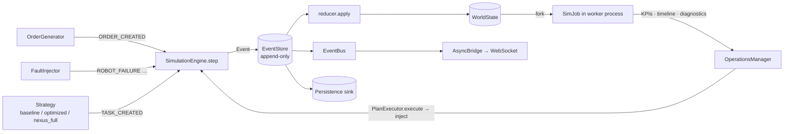

# Architecture

NEXUS is a single Python engine (`backend/nexus`) that owns one deterministic world, wrapped by a FastAPI/WebSocket
API and a Next.js twin UI. Every change to the world is an event applied by a pure reducer; every plan or what-if is
evaluated in a *forked* copy of the world before anything touches the live one. Heavy evaluation runs in worker
processes, the live twin ticks on its own thread, and the API only ever reads under a lock. This document describes the
components, the data flow, the threading and process model, the determinism guarantees, and the deployment topology.

## Component map

```
                         ┌──────────────────────────────────────┐
                         │   NEXUS UI (Next.js 15 · Three.js)   │  frontend/
                         │   Live twin · Decisions · What-If    │
                         │   Forecast · Console · Timeline      │
                         └───────────────┬──────────────────────┘
                                         │ REST + WebSocket (docs/API.md)
                         ┌───────────────▼──────────────────────┐
                         │   API layer  nexus/api  (FastAPI)    │
                         │   routes/core · routes/intelligence  │
                         │   ws.py · schemas.py (pydantic)      │
                         └───────────────┬──────────────────────┘
                                         │ LiveRuntime façade (nexus/runtime/live.py)
        ┌────────────────────────────────┼────────────────────────────────┐
        ▼                                ▼                                ▼
┌───────────────┐              ┌──────────────────┐              ┌──────────────────┐
│  Twin engine  │              │  Agent runtime   │              │  Event engine    │
│  nexus/twin   │              │  nexus/agents    │              │  nexus/events    │
│  WorldState   │◄─ reducer ───│  OpsManager …    │─ emit/inject►│  EventStore/Bus  │
│  GridMap      │              │  nexus/whatif    │              │  reducer/replay  │
│  SpatialGraph │              │  nexus/nlq       │              └──────────────────┘
└───────┬───────┘              └────────┬─────────┘
        │                               │ forks
        ▼                               ▼
┌──────────────────────────────────────────────────────────────┐
│  Simulation engine  nexus/simulation  (deterministic ticks)   │
│  kinematics · pathfinding · orders · faults · metrics         │
└───────────────────────────┬──────────────────────────────────┘
                            ▼
┌──────────────────────────────────────────────────────────────┐
│  Optimization  nexus/optimization  ·  Forecasting  nexus/forecasting │
│  CP-SAT / Hungarian / GA · batching · EDF · routing policy     │
└──────────────────────────────────────────────────────────────┘
```

| Package | Responsibility | Key types |
|---|---|---|
| `nexus/core` | config (`NEXUS_*` env), structlog logging, `SimClock`, `SeededRNG`, `IdGen` | `Settings` |
| `nexus/twin` | entities, `WorldState`, `GridMap`, `SpatialGraph`, warehouse layouts, `DomainModel` | `WorldState`, `Zone`, `Robot`, `Order`, `Task` |
| `nexus/events` | `EventType`, `Event`, `EventStore`, `EventBus`/`AsyncBridge`, reducer, replay | `Event`, `EventStore` |
| `nexus/simulation` | `SimulationEngine`, `Pathfinder`, `OrderGenerator`, `FaultInjector`, KPIs, `GreedyStrategy` | `SimulationEngine`, `KPIs` |
| `nexus/optimization` | objective, constraints, batching, weighted EDF, CP-SAT/Hungarian/greedy/GA assignment, `RoutingPolicy`, `OptimizedStrategy` | `OptimizationEngine` |
| `nexus/forecasting` | `HistoryRecorder`, Holt-Winters, demand/battery/congestion forecasts, bottlenecks | `Forecaster` |
| `nexus/agents` | situation analysis, planner, validator, optimizer agent, simulator (process pool), risk, policy, executor, Operations Manager, `ai_planner`/`nexus_full` strategies | `OperationsManager` |
| `nexus/whatif` | scenario DSL → scheduled faults, presets, multi-strategy evaluation, async jobs | `WhatIfEngine` |
| `nexus/nlq` | intent routing, parameter extraction, delay attribution, grounded answers | `NLQService` |
| `nexus/llm` | Ollama client (structured output), prompts, SOP retrieval (TF-IDF) | `LLMClient`, `NullLLM` |
| `nexus/runtime` | the live loop thread, snapshots, fault presets, the façade used by the API | `LiveRuntime` |
| `nexus/api` | FastAPI app factory, routers, WebSocket, pydantic contract | `create_app` |
| `nexus/persistence` | PostgreSQL/SQLite event + snapshot + decision store, Redis fan-out | `Persistence`, `RedisPublisher` |
| `nexus/observability` | Prometheus metrics, OpenTelemetry tracing | `metrics`, `setup_tracing` |

## Data flow



1. **Inputs** arrive as events: the order generator and fault injector (engine-internal, regenerated on replay) and
   external commands (`engine.inject`, origin `user`/`agent`/`scenario`, idempotent by `key`).
2. **`SimulationEngine.emit`** appends the event to the `EventStore` (sequence number, id), applies it through the
   reducer, publishes it on the bus, and lets the strategy react (`on_event`).
3. **Observers** (WebSocket bridge, persistence sink, Prometheus counters, `HistoryRecorder` hook) never mutate the
   world.
4. **Decisions and what-ifs** fork the world (`WorldState.fork()` — a pickle round-trip), run a `SimJob` per candidate,
   and only the approved plan is executed against the live engine as ordinary events.

## Threading model (`nexus/runtime/live.py`)

* One **loop thread** (`nexus-live-loop`) advances the engine at `ticks_per_second` (budgeted, up to 200 steps per wake).
  Every step is wrapped in `LiveRuntime.lock` (an `RLock`).
* **API handlers** take the same lock for short reads (`world_dict`, `kpis`, `entity`, `spatial`) and for writes
  (`inject`, `control`). Long operations (`decide`, `whatif_run`, `nlq`) run in FastAPI's thread pool; they fork the
  world under the lock and simulate outside it.
* The **Operations Manager** receives the runtime's lock; it forks the world, pickles a clone of the strategy and copies
  the pending scheduled faults under the lock, plans/simulates without it, and re-acquires it to record `PLAN_*` events
  and to execute the approved plan.
* **Autopilot**: trigger events (`ROBOT_FAILURE`, `ZONE_CLOSED`, `DOCK_CLOSED`, `AISLE_BLOCKED`, `CHARGER_DISABLED`,
  `DEMAND_CHANGED`) set a pending trigger; after a 900-tick cooldown the loop thread spawns a `nexus-autopilot` thread
  that runs `decide_and_maybe_execute`, so the twin never pauses while agents think.
* **What-if jobs** submitted through `POST /api/whatif` run on a daemon thread per job; completion pushes a `whatif`
  frame to WebSocket clients.
* **WebSocket fan-out** goes through `AsyncBridge.push` → `loop.call_soon_threadsafe` → per-client `asyncio.Queue`
  (oldest frames dropped when a client falls behind). Tick frames are throttled to ~20 per wall-second.

## Process model

`nexus/agents/simulator.py` serialises a simulation into a `SimJob` (world bytes, pickled strategy, plan dict, horizon,
seed salt, scheduled faults). `run_jobs` executes jobs in a persistent `ProcessPoolExecutor` when `workers > 1` and there
are at least three jobs, and falls back to in-process execution on any pool error. The engine is pure Python, so
processes — not threads — are what buy parallelism: a decision with eight candidates simulates them on four cores in
roughly a quarter of the sequential time. Strategies that run *inside* a job (`nexus_full`) always simulate their own
candidates in-process (`workers=1`) to avoid nested pools.

## Determinism guarantees

* Simulated time is an integer tick; wall-clock never enters the engine.
* All randomness flows through one `SeededRNG` inside the world; forks copy its state, stability re-runs derive new
  streams from it (`rng.derive(salt)`).
* The tick's order of operations is fixed (see `docs/SIMULATION.md`); robots are advanced in id order.
* Ids are generated from counters in the world (`IdGen`), so forks and replays produce identical ids.
* CP-SAT runs single-worker with a fixed seed; the GA uses `random.Random(seed)`.
* `WorldState.digest()` hashes everything behaviour-relevant. The test-suite asserts: same seed ⇒ same digest; a fork
  continues identically to its parent; a replay from snapshot + external events reproduces the digest.

## Forks

`WorldState.fork()` pickles and unpickles the world (≈5 ms small, ≈26 ms large), marks it `is_fork`, and rebuilds the
derived caches (occupancy, zone occupancy, open-order index). A fork carries the clock, RNG state, id counters, demand
profile, config and stats, so a simulation started from a fork evolves exactly as the live world would have — until a
plan or scenario diverges it. Strategies are cloned by pickle as well; `OptimizedStrategy` drops its engine references
on pickle and rebuilds them lazily.

## API ↔ runtime mapping

| API | Runtime call | Lock | Runs in |
|---|---|---|---|
| `GET /api/world`, `/kpis`, `/spatial`, `/events*` | `world_dict`, `kpis`, `spatial`, `events_since` | yes (short) | request / thread pool |
| `POST /api/sim/control` | `control` | yes | thread pool |
| `POST /api/events/inject`, `/faults/{id}` | `inject`, `fire_preset` | yes | request |
| `GET /api/forecast` | `forecast` (forks world + history) | fork only | thread pool |
| `POST /api/decisions` | `decide` → `OperationsManager.decide` | fork + PLAN events | thread pool (+ process pool) |
| `POST /api/whatif` / `/whatif/run` | `whatif.submit` / `whatif_run` | fork only | job thread / thread pool |
| `POST /api/nlq` | `NLQService.ask` | per intent | thread pool |
| `WS /ws/live` | `frame_listeners` via `AsyncBridge` | — | event loop |

## Deployment topology (`docker-compose.yml`)

| Service | Image | Port | Purpose |
|---|---|---|---|
| `backend` | `backend/Dockerfile` (python 3.13 + uv) | 8000 | API, live twin, agents |
| `frontend` | `frontend/Dockerfile` (node 24, standalone) | 3000 | twin UI |
| `postgres` | postgres:16-alpine | 5432 | events, snapshots, decisions, what-if results |
| `redis` | redis:7-alpine | 6379 | live-frame fan-out (`nexus:live`) |
| `prometheus` | prom/prometheus | 9090 | scrapes `backend:8000/metrics` every 5 s |
| `grafana` | grafana/grafana | 3001 | provisioned "NEXUS · Live Twin" dashboard (admin / nexus) |
| `ollama` | ollama/ollama (profile `llm`) | 11434 | optional in-compose LLM; default is the host's Ollama |

The backend is fully functional without PostgreSQL, Redis or Ollama: persistence degrades to in-memory, Redis publishing
is skipped, and the planner falls back to deterministic playbooks.

## Scaling notes

* The engine is single-process by design (determinism); parallelism comes from evaluating many forks at once.
  Decision latency scales with `candidates × horizon / workers`.
* `HistoryRecorder`, snapshots (`deque(maxlen=120)`) and the event ring buffer are bounded; the persisted event log grows
  linearly with non-ephemeral events (~1–3 per order plus incidents) and is batch-inserted by an async writer.
* Large scale (100 robots, 50 storage zones) runs at ≈500 ticks/s with the baseline scheduler and ≈200 ticks/s with the
  optimizer; a 90-minute candidate simulation therefore costs 10–30 s of CPU at that scale, which is why the horizon and
  candidate count are configurable (`NEXUS_SIM_HORIZON_TICKS`, `NEXUS_CANDIDATE_PLANS`, `NEXUS_DECISION_WORKERS`).
* Horizontal scaling: several backends can run different worlds (one twin per process); Redis fan-out lets other
  services consume the live stream without touching the engine.
